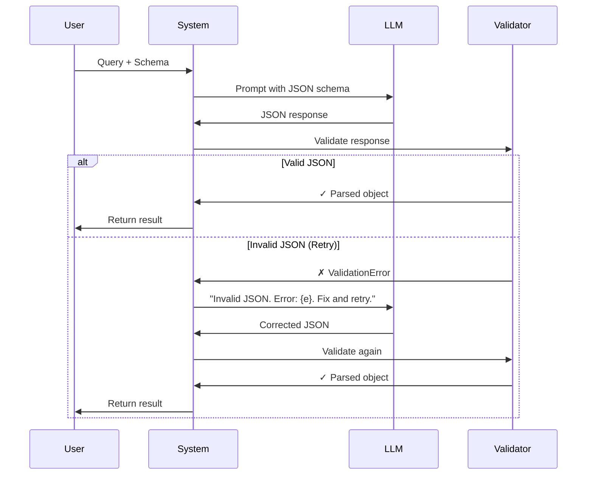

# Structured Output

## What You'll Learn

- Why agents need structured output (not free-form text)
- How to get reliable JSON from an LLM
- Parsing and validating responses with Pydantic
- Retry logic when parsing fails

## Prerequisites

- Python 3.10+
- OpenAI API key configured
- Basic familiarity with Pydantic

## The Concept

Agents need to make decisions: which tool to call, what arguments to pass, whether to continue or stop. Free-form text makes this hard — you'd need to parse natural language.

**Structured output** solves this. Instead of:

> "I think we should use the calculator tool with the numbers 5 and 3"

We get:

```json
{"tool": "calculator", "args": {"a": 5, "b": 3}}
```

This is parseable, validatable, and unambiguous. It's the foundation everything else builds on.

## Key Implementation

### 1. Define a schema with Pydantic

```python
from pydantic import BaseModel
from typing import Literal

class MultiChoice(BaseModel):
    answer: Literal["A", "B", "C", "D"]
```

Pydantic gives us:
- Type validation (the answer must be A, B, C, or D)
- JSON schema generation (for the prompt)
- Easy parsing from JSON strings

### 2. Add the schema to the prompt

```python
SCHEMA_PROMPT_TEMPLATE = """
{user_query}

Respond with JSON matching this schema: {schema}
Return only valid JSON, no other text.
""".strip()

schema_json = schema.model_json_schema()
prompt = SCHEMA_PROMPT_TEMPLATE.format(user_query=user_query, schema=schema_json)
```

The key insight: we convert the Pydantic model to a JSON schema and include it in the prompt. The LLM sees exactly what structure we expect.

### 3. Parse and validate the response

```python
try:
    return schema.model_validate_json(llm_output)
except ValidationError as e:
    # Handle the error...
```

`model_validate_json` does two things: parses the JSON string and validates it against the schema.

### 4. Retry with error feedback

When parsing fails, we don't just retry blindly — we tell the LLM what went wrong:

```python
for _ in range(max_retries):
    llm_output = call_llm(messages)

    try:
        return schema.model_validate_json(llm_output)
    except ValidationError as e:
        # Add the failed attempt to conversation history
        messages.append({"role": "assistant", "content": llm_output})
        messages.append({
            "role": "user",
            "content": f"Invalid JSON. Error: {e}. Please fix and try again."
        })
```

This gives the LLM context to correct its mistake.

**Retry Flow Diagram:**



## Full Implementation

See complete code: [`implementations/01_structured_output/`](https://github.com/liaohaofu/agent-system-tutorials/tree/main/implementations/01_structured_output)

- [`main.py`](https://github.com/liaohaofu/agent-system-tutorials/blob/main/implementations/01_structured_output/main.py) — Manual approach (schema in prompt, parse, validate, retry)
- [`main_openai.py`](https://github.com/liaohaofu/agent-system-tutorials/blob/main/implementations/01_structured_output/main_openai.py) — OpenAI's native structured output API

## How It Works in Production

Our manual approach works, but production systems do it better:

**1. Constrained Decoding**

Instead of hoping the LLM outputs valid JSON, constrained decoding *forces* it. At each token, only tokens that could produce valid JSON matching the schema are allowed.

Libraries like [Outlines](https://github.com/dottxt-ai/outlines) implement this for open-source models.

**2. Native API Support**

OpenAI's API has built-in structured output. Compare our manual version to the native version:

```python
# Native OpenAI approach
response = client.responses.parse(
    model=model,
    input=[{"role": "user", "content": user_query}],
    text_format=schema,
)
return response.output_parsed
```

The API guarantees the response matches the schema — no parsing or retry needed on your end.

## Try It Yourself

- [ ] Run `main.py` and verify you get a valid `MultiChoice` response
- [ ] Modify the schema to include a `confidence` field (float between 0 and 1)
- [ ] Try a schema that the LLM is likely to fail on — observe the retry behavior
- [ ] Compare the manual approach with `main_openai.py` — what's different?

## What's Next

Now that we can get structured decisions from the LLM, we can define **tools** for it to call. Next up: [Tool Use](02-tool-use.md).