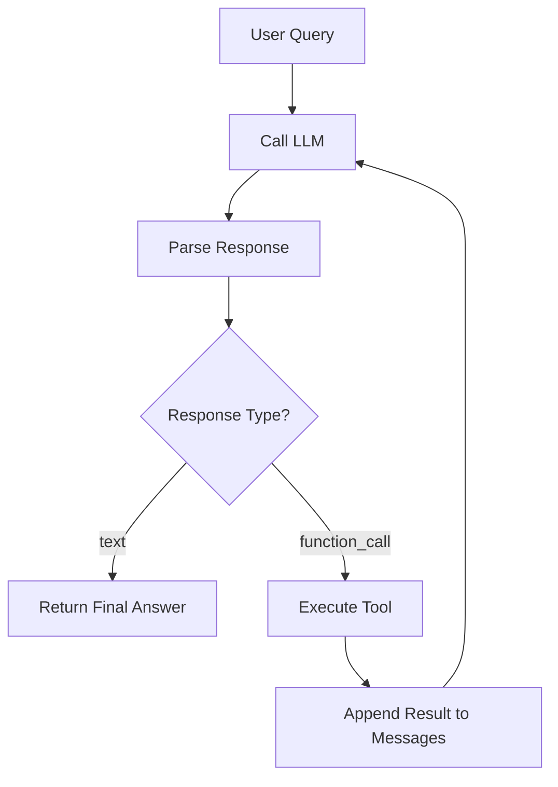

# Agent Loop

## What You'll Learn

- The core agent pattern: think → act → observe → repeat
- How to feed tool results back to the LLM
- When to terminate (final answer vs. continue looping)
- How to prevent infinite loops with safety limits

## Prerequisites

- [Tool Use](02-tool-use.md) — understanding single-shot tool calling
- Python 3.10+
- OpenAI API key configured

## The Concept

In the previous tutorial, we built single-shot tool use: user asks → LLM picks a tool → we execute → done. But what if the task requires *multiple* tools?

Consider: "I have $5, and I want to buy 5 bananas. Is it possible with the current inventory and price?"

This needs:

1. Check the price of bananas
2. Check the inventory of bananas
3. Do the math and answer

Single-shot can't do this. We need a **loop**.



The key insight: after executing a tool, we feed the result back to the LLM. The LLM then decides: call another tool, or give a final answer?

## Key Implementation

### 1. Define tool structure

We need two data structures: one for the LLM to read (documentation), one for us to execute (dispatch).

```python
tools = [
    {
        "function": get_price,
        "description": "check the unit price of an item, returns price in $",
        "parameters": Parameters,  # Pydantic model
    },
    {
        "function": get_inventory,
        "description": "check the inventory (count) of an item",
        "parameters": Parameters,
    },
]
```

Inside the loop, we build both:

```python
tools_doc = []   # For LLM to read
tools_dict = {}  # For us to execute

for tool in tools:
    tools_doc.append({
        "name": tool["function"].__name__,
        "description": tool["description"],
        "parameters": tool["parameters"].model_json_schema(),
    })
    tools_dict[tool["function"].__name__] = {
        "function": tool["function"],
        "parameters": tool["parameters"],
    }
```

### 2. Initialize message history

The conversation starts with the system prompt (tools + response format) and user query:

```python
messages = [
    {
        "role": "developer",
        "content": f"You are provided with the following tools: {tools_doc}. "
                   f"Please respond in this format: {Response.model_json_schema()}. "
                   f"ALWAYS RESPOND DIRECTLY",
    },
    {"role": "user", "content": user_query},
]
```

### 3. The loop

The core pattern: call LLM → parse → act → repeat.

```python
for iteration in range(1, max_steps + 1):
    llm_output = call_llm(messages, model=model)
    messages.append({"role": "assistant", "content": llm_output})

    # Parse LLM response
    response = Response.model_validate_json(llm_output)

    # Final answer - exit loop
    if response.type == "text":
        print(f"[Iteration {iteration}] {response.content}")
        break

    # Function call - execute and continue
    function_name = response.content.name
    parameters = tools_dict[function_name]["parameters"].model_validate_json(
        response.content.parameters
    )
    result = tools_dict[function_name]["function"](**parameters.model_dump())

    tool_message = f"{function_name} returned {result}"
    print(f"[Iteration {iteration}] {tool_message}")
    messages.append({"role": "user", "content": f"[Tool Result] {tool_message}"})
```

Key points:

- **`messages.append`**: Every LLM response and tool result gets added to history
- **`break` on text**: When the LLM returns a final answer, we exit
- **Tool result as user message**: We feed results back with a `[Tool Result]` prefix

### 4. Safety limit

The `for` loop has a max iterations limit. If the LLM keeps calling tools without giving a final answer:

```python
else:
    print(f"[Iteration {iteration}] Max step reached")
```

This prevents infinite loops — a critical safety feature.

## Example Run

```
==================================================
Query: I have $5, and I want to buy 5 bananas. Is it possible?
==================================================

[Iteration 1] get_price returned 0.75
[Iteration 2] get_inventory returned 10
[Iteration 3] Yes, you can buy 5 bananas! The total cost would be $3.75
              (5 × $0.75), which is within your $5 budget, and there are
              10 bananas in stock.
```

The agent:

1. Called `get_price("banana")` → got 0.75
2. Called `get_inventory("banana")` → got 10
3. Did the math and answered

Three iterations, two tool calls, one final answer.

## Error Handling

The implementation handles several error cases:

```python
# Unknown function
if function_name not in tools_dict:
    error_message = f"{function_name} call error: unknown function"
    messages.append({"role": "user", "content": error_message})
    continue

# Invalid parameters
try:
    parameters = tools_dict[function_name]["parameters"].model_validate_json(...)
except Exception as e:
    error_message = f"You returned invalid function call parameters: {str(e)}"
    messages.append({"role": "user", "content": error_message})
    continue

# Tool execution error
try:
    result = tools_dict[function_name]["function"](**parameters.model_dump())
except Exception as e:
    tool_message = f"{function_name} call error: {str(e)}"
```

Errors are fed back to the LLM, which can then try again or give up gracefully.

## Full Implementation

See complete code: [`implementations/03_agent_loop/`](https://github.com/liaohaofu/agent-system-tutorials/tree/main/implementations/03_agent_loop)

- [`main.py`](https://github.com/liaohaofu/agent-system-tutorials/blob/main/implementations/03_agent_loop/main.py) — Manual approach (build the loop yourself)
- [`main_openai.py`](https://github.com/liaohaofu/agent-system-tutorials/blob/main/implementations/03_agent_loop/main_openai.py) — OpenAI Agent SDK approach

## OpenAI Agent SDK Approach

The SDK abstracts away the entire loop:

```python
from agents import Agent, Runner, function_tool

@function_tool
def get_price(item: str) -> float:
    """Check the unit price of an item, returns price in $"""
    prices = {"apple": 1.5, "banana": 0.75, "orange": 1.0}
    return prices.get(item, 0)

agent = Agent(name="Assistant", tools=[get_price], model="gpt-5")
result = Runner.run_sync(agent, user_query, max_turns=5)
print(result.final_output)
```

The SDK handles:

- Message history management
- Response parsing
- Tool execution
- Loop termination

This is what frameworks hide. Now you know what's inside.

## What This Doesn't Do (Yet)

This tutorial covers the basic sequential loop:

- One tool call per iteration
- Tools execute one at a time
- No planning ahead

What's missing:

- **Parallel tool execution** — calling multiple tools at once
- **Planning** — deciding the sequence of tools before executing
- **Memory management** — handling long conversations

## Try It Yourself

- [ ] Run `main.py` and watch the iterations print
- [ ] Ask a question that needs 3+ tool calls — does it work?
- [ ] Ask "Hi" — does the agent respond without calling tools?
- [ ] Set `max_steps=2` and ask a complex question — what happens?
- [ ] Add a third tool and verify the agent uses it correctly

## What's Next

We have a working agent loop. Next, we'll explore how to package reusable capabilities using **Agent Skills** — a standard for giving agents domain expertise without hardcoding it.