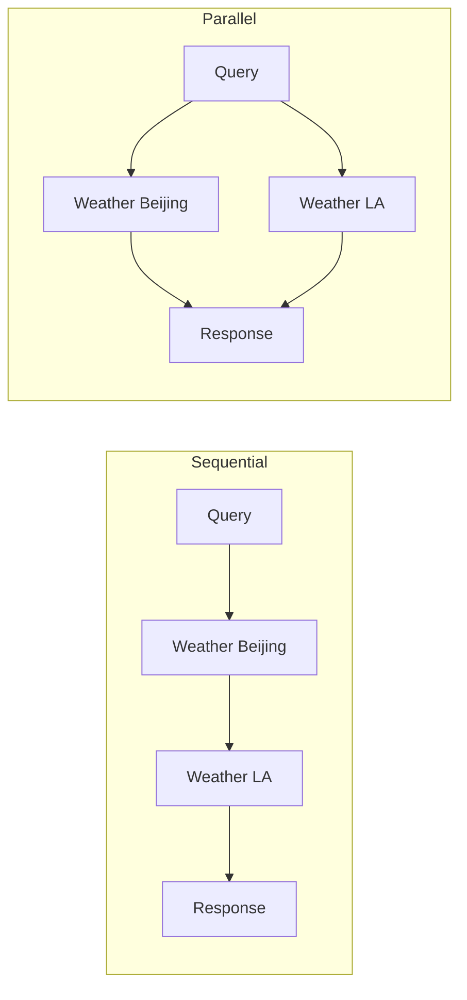

# Parallel Tool Execution

## What You'll Learn

- How to extend the agent loop to support multiple tool calls per response
- Schema design for parallel outputs (per-item type vs top-level type)
- Using tool call IDs to correlate results with requests
- Parallel execution with `ThreadPoolExecutor`

## Prerequisites

- [Agent Loop](03-agent-loop.md) — the sequential loop pattern
- Python 3.10+
- OpenAI API key configured

## The Concept

In the previous tutorial, our agent called one tool at a time. But what if the user asks: "What's the weather in Beijing and LA?"

With sequential execution:

1. Call `get_weather("Beijing")` → wait → get result
2. Call `get_weather("LA")` → wait → get result
3. Respond

These calls are independent — there's no reason to wait. With parallel execution:

1. Call `get_weather("Beijing")` AND `get_weather("LA")` simultaneously
2. Collect both results
3. Respond



The key insight: when the LLM returns multiple tool calls, execute them in parallel and return all results together.

## Key Implementation Changes

This builds on the Agent Loop from Chapter 3. Here are the key differences:

| Aspect | Agent Loop (Ch. 3) | Parallel Tools (Ch. 4) |
|--------|-------------------|------------------------|
| Schema | Single `response.type` field | Per-output `type` field on each item |
| Tool calls | One at a time | Multiple in parallel |
| Execution | Sequential | `ThreadPoolExecutor` |
| Result format | Single result | Results keyed by ID |

### 1. New response schema

Instead of a single response type, we now have a list of outputs — each with its own type:

```python
class FunctionCall(BaseModel):
    id: str = Field(description="a unique id")
    type: Literal["function_call"] = "function_call"
    name: str = Field(description="name of the function call")
    parameters: str = Field(description="parameters as JSON string")


class Message(BaseModel):
    type: Literal["message"] = "message"
    text: str = Field(description="content of the message")


class Response(BaseModel):
    content: list[Message | FunctionCall] = Field(
        description="a list of outputs - each is either a message or function_call"
    )
```

Key changes:

- **`id` field on FunctionCall**: Correlates each result with its original call
- **Per-item `type`**: Each output declares its own type
- **List of outputs**: LLM can return messages AND function calls together

### 2. Separate function calls from messages

After parsing the response, we split the outputs:

```python
response = Response.model_validate_json(llm_output)

returned_function_calls = [
    item for item in response.content
    if isinstance(item, FunctionCall)
]
returned_messages = [
    item for item in response.content
    if isinstance(item, Message)
]
```

The LLM might say "I'll check both cities for you" (message) while also issuing two weather calls (function_calls).

### 3. Parallel execution with ThreadPoolExecutor

This is the core change — executing multiple tools simultaneously:

```python
from concurrent.futures import ThreadPoolExecutor, as_completed
from functools import partial

if returned_function_calls:
    function_call_results = []

    with ThreadPoolExecutor() as executor:
        # Submit all tool calls
        futures = {
            executor.submit(partial(execute_tool, tools_dict), fc): fc
            for fc in returned_function_calls
        }

        # Collect results as they complete
        for future in as_completed(futures):
            function_call = futures[future]
            result = future.result()
            function_call_results.append({
                "id": function_call.id,
                "result": result
            })
```

Key points:

- **`ThreadPoolExecutor`**: Manages a pool of worker threads
- **`executor.submit()`**: Schedules each tool call to run in parallel
- **`as_completed()`**: Yields futures as they finish (in completion order)
- **Result keyed by ID**: Each result includes the original call's ID

### 4. Updated termination condition

The loop now terminates when the response contains **no function calls**:

```python
if returned_function_calls:
    # Execute tools and continue looping
    ...
else:
    # No function calls = final answer
    final_response = "\n".join(msg.text for msg in returned_messages)
    return final_response
```

## Example Run

```
Q: How is the weather in Beijing and LA?

[Step 1] Agent: I'll check the weather in both cities for you.
[Step 1] Tool results:
----------
Function call results: [
  {"id": "weather_beijing", "result": "cloudy, 5 degrees"},
  {"id": "weather_la", "result": "sunny, 20 degrees"}
]
----------

[Step 2] Agent: Beijing is cloudy at 5 degrees, LA is sunny at 20 degrees.

A:
Beijing is cloudy at 5 degrees, LA is sunny at 20 degrees.
```

Both weather calls executed in parallel in Step 1. The agent then combined the results in Step 2.

## Multi-Step Parallel Workflow

The pattern handles complex workflows too:

```
Q: Get the weather in Beijing and LA and send me a summary email.

[Step 1] Get weather for both cities (parallel)
[Step 2] Get user profile (to find email address)
[Step 3] Send summary email
```

The agent decides which calls can be parallel (both weather queries) and which must be sequential (email after getting results).

## Error Handling

The `execute_tool` function handles errors gracefully — if a tool fails, the error is returned as a result string:

```python
def execute_tool(tools_dict: dict, function_call: FunctionCall) -> str:
    if function_call.name not in tools_dict:
        return f"Unknown tool: {function_call.name}"

    try:
        parameters_obj = parameters_format.model_validate_json(function_call.parameters)
    except Exception as e:
        return f"Invalid function call parameters: {e}"

    try:
        tool_response = tool(**parameters)
        return str(tool_response)
    except Exception as e:
        return f"Tool call failed: {e}"
```

This means if 2 of 3 parallel tools fail, the LLM still receives partial results plus error messages — it can then decide how to proceed.

## Full Implementation

See complete code: [`implementations/04_parallel_tools/`](https://github.com/liaohaofu/agent-system-tutorials/tree/main/implementations/04_parallel_tools)

- [`main.py`](https://github.com/liaohaofu/agent-system-tutorials/blob/main/implementations/04_parallel_tools/main.py) — Manual approach with ThreadPoolExecutor

## Try It Yourself

- [ ] Run `main.py` and observe the parallel execution
- [ ] Add timing to prove tools run in parallel (not sequentially)
- [ ] Ask a question that requires both parallel AND sequential steps
- [ ] Deliberately break one tool — does the agent still get partial results?
- [ ] Try with more than 2 parallel calls — does it scale?
