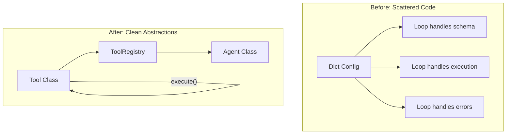
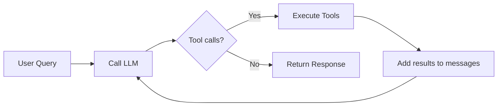

# Agent Class Architecture

## What You'll Learn

- Why scattered tool code becomes hard to maintain
- How to create a self-describing `Tool` class
- How to centralize tool management with `ToolRegistry`
- How to orchestrate everything with an `Agent` class
- What frameworks like LangChain actually hide from you

## Prerequisites

- [Parallel Tools](04-parallel-tools.md) — the implementation we'll refactor
- Python 3.10+
- OpenAI API key configured

## The Concept

In the previous tutorials, our tools were defined as dictionaries with scattered metadata:

```python
tools = [
    {"function": get_weather, "parameters": GetWeatherParameters},
    {"function": send_email, "parameters": SendEmailParameters},
]
```

This works, but has problems:

1. **Metadata is scattered** — Name comes from `__name__`, description from `__doc__`
2. **Schema generation happens elsewhere** — In the agent loop, not with the tool
3. **Execution logic is separate** — A standalone `execute_tool()` function
4. **No type safety** — Easy to forget a field or pass the wrong type

Let's fix this with proper abstractions. By the end, you'll understand what frameworks like LangChain hide behind their decorators and classes.



## Key Implementation

### 1. Tool Class — Self-Describing Tools

The `Tool` class encapsulates everything about a tool in one place:

```python
@dataclass
class Tool:
    name: str
    description: str
    parameters: type[BaseModel]
    function: Callable

    @classmethod
    def from_function(cls, function: Callable, parameters: type[BaseModel]) -> "Tool":
        return cls(
            name=function.__name__,
            description=str(function.__doc__),
            parameters=parameters,
            function=function,
        )

    def to_schema(self) -> dict:
        return {
            "name": self.name,
            "description": self.description,
            "parameters": self.parameters.model_json_schema()
        }

    def execute(self, parameters_str: str) -> str:
        try:
            parameters_obj = self.parameters.model_validate_json(parameters_str)
            parameters_dict = parameters_obj.model_dump()
        except Exception as e:
            return f"Invalid tool call parameters: {e}"

        try:
            tool_response = self.function(**parameters_dict)
            return str(tool_response)
        except Exception as e:
            return f"Tool call failed: {e}"
```

Key points:

- **`from_function()`**: Factory method that extracts name/description automatically
- **`to_schema()`**: Generates the JSON schema for the LLM — no external code needed
- **`execute()`**: Handles parameter validation AND execution AND errors — all in one place

### 2. ToolRegistry — Centralized Tool Management

The registry manages all tools and provides a clean interface:

```python
class ToolRegistry:
    def __init__(self):
        self._tools: dict[str, Tool] = {}

    def register(self, tool: Tool):
        self._tools[tool.name] = tool

    def execute(self, name: str, parameters: str) -> str:
        if name in self._tools:
            return self._tools[name].execute(parameters)
        else:
            return f"Tool '{name}' not registered"

    def to_schemas(self) -> list[dict]:
        return [
            self._tools[tool_name].to_schema()
            for tool_name in sorted(self._tools)
        ]
```

The registry:

- **Stores tools by name** for fast lookup
- **Handles unknown tools** gracefully with error messages
- **Generates all schemas at once** for the system prompt

### 3. Agent Class — Orchestrating Everything

The `Agent` class brings it all together, including the agent loop from previous tutorials:

```python
class Agent:
    def __init__(self, tools: list | None = None, model: str = "gpt-4o", max_steps: int = 10):
        self._tool_registry = ToolRegistry()
        tools = tools or []
        for tool_dict in tools:
            tool_obj = Tool.from_function(**tool_dict)
            self._tool_registry.register(tool_obj)

        self.model = model
        self.max_steps = max_steps
        self._client = OpenAI()
        self.system_prompt = self._build_system_prompt()

    def run(self, user_query: str) -> str:
        messages = [
            {"role": "developer", "content": self.system_prompt},
            {"role": "user", "content": user_query}
        ]

        for step in range(self.max_steps):
            llm_output = self._call_llm(messages)
            # ... parse response, execute tools, loop until done
```

The `run()` method encapsulates the **agent loop** pattern we built in previous tutorials:



Each iteration:

1. **Call LLM** with current messages
2. **Parse response** into tool calls and messages
3. **If tool calls exist**: execute them in parallel, add results to messages, continue loop
4. **If no tool calls**: return the final response

The agent:

- **Registers tools on init** using the `Tool.from_function()` factory
- **Builds the system prompt** from the registry's schemas
- **Runs the loop** with parallel tool execution (from Chapter 4)
- **Returns the final response** when no more tool calls are needed

## Using the Agent

With these abstractions, using the agent is clean and simple:

```python
tools = [
    {"function": get_weather, "parameters": GetWeatherParameters},
    {"function": send_email, "parameters": SendEmailParameters},
    {"function": get_user_profile, "parameters": GetUserProfileParameters}
]

agent = Agent(tools)
response = agent.run("How is the weather in Beijing and LA?")
print(response)
```

The same tool definition format as before — but now the complexity is hidden inside well-structured classes.

## What This Pattern Reveals

This is exactly what frameworks like LangChain do behind their `@tool` decorators:

| Framework Magic | What It Actually Does |
|-----------------|----------------------|
| `@tool` decorator | Creates a `Tool` object with metadata |
| Tool registry | Stores and looks up tools by name |
| Agent executor | Runs the loop, calls tools, manages messages |
| Schema generation | Calls `to_schema()` on each tool |

Now you can build these abstractions yourself — and modify them when you need behavior that frameworks don't support.

## Full Implementation

See complete code: [`implementations/05_agent_class/`](https://github.com/liaohaofu/agent-system-tutorials/tree/main/implementations/05_agent_class)

- [`main.py`](https://github.com/liaohaofu/agent-system-tutorials/blob/main/implementations/05_agent_class/main.py) — Tool, ToolRegistry, and Agent classes with parallel execution

## Try It Yourself

- [ ] Run `main.py` and verify it works like the previous tutorial
- [ ] Add a new tool — how much easier is it now?
- [ ] Add a `list_tools()` method to the Agent class
- [ ] Try subclassing `Tool` for tools that need special execution logic
- [ ] Add logging to see every tool call and result

## What's Next

In the next tutorial, [6. Session Management](06-session-management.md), we'll separate conversation state from agent logic. You'll learn why frameworks decouple Agent from Session, and how to manage context to prevent overflow in long conversations.
