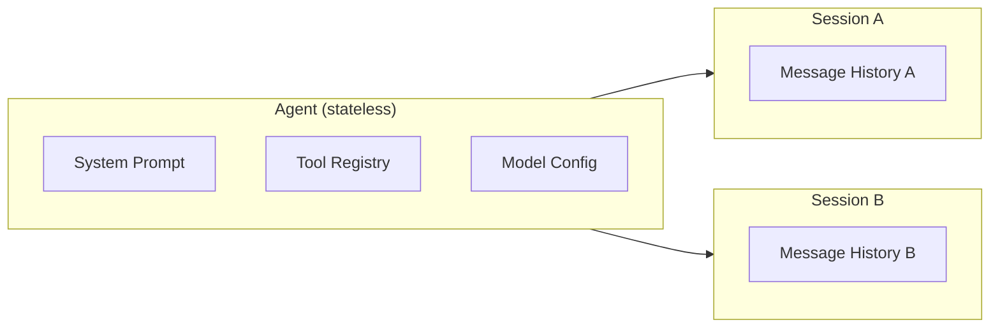

# Session Management

## What You'll Learn

- Why Session should be separate from Agent (reusability, single responsibility)
- How to design a Session class for message history
- Token-based context management with LLM summarization
- Running the same agent across multiple independent sessions

## Prerequisites

- [Agent Class Architecture](05-agent-class.md) — the Agent class we'll extend
- Python 3.10+
- OpenAI API key configured

## The Concept

In the previous tutorial, our `Agent` class managed messages directly inside the `run()` method:

```python
def run(self, user_query: str) -> str:
    messages = [
        {"role": "developer", "content": self.system_prompt},
        {"role": "user", "content": user_query}
    ]
    # ... loop adds messages here
```

This works for single queries, but has problems:

1. **No conversation continuity** — Each `run()` starts fresh with no history
2. **Agent and state are coupled** — Can't reuse the same agent with different conversations
3. **No context management** — Messages grow unbounded until you hit the context limit

The solution: separate **what the agent is** (tools, system prompt, behavior) from **what's being discussed** (conversation history).



One agent, multiple independent sessions. This is the pattern frameworks use — and now you'll understand why.

## Key Implementation

### 1. Session Class — Conversation State

The `Session` class owns the message history:

```python
@dataclass
class Session:
    id: str = field(default_factory=lambda: str(uuid.uuid4()))
    _messages: list[dict] = field(default_factory=list)

    def add_message(self, role, content):
        self._messages.append(dict(role=role, content=content))

    def set_messages(self, messages: list[dict]):
        self._messages = messages

    def get_messages(self) -> list[dict]:
        return list(self._messages)
```

Key design decisions:

- **Unique ID** — Each session has an identifier (useful for persistence later)
- **Private `_messages`** — Access through methods for encapsulation
- **`set_messages()`** — Allows replacing history (needed for compaction)
- **`get_messages()` returns a copy** — Prevents accidental mutation

### 2. Agent Uses Session

The `Agent` now accepts an optional session and combines it with the system prompt:

```python
class Agent:
    def __init__(self, tools=None, model="gpt-4o", max_steps=10, max_prompt_tokens=100_000):
        # ... tool registry setup ...
        self.max_prompt_tokens = max_prompt_tokens
        self.system_prompt = self._build_system_prompt()

    def _build_messages(self, session: Session):
        return [dict(role="developer", content=self.system_prompt)] + session.get_messages()

    def run(self, user_query, session: Session | None = None) -> str:
        if not session:
            session = Session()
        session.add_message(role="user", content=user_query)

        for step in range(self.max_steps):
            llm_output, usage = self._call_llm(self._build_messages(session))
            # ... rest of loop
```

The key insight: **Agent owns the system prompt** (defines agent identity), **Session owns the conversation** (what's been said).

### 3. Context Management with Summarization

When conversations get long, we need to prevent context overflow. The approach:

1. Set a **soft token limit** (`max_prompt_tokens`) below the model's hard limit
2. After each LLM call, check if we're over the limit
3. If over, **summarize the history** using the LLM itself

```python
def _compact_session(self, session: Session):
    session_messages = session.get_messages()
    compact_messages, _ = self._call_llm(
        [{
            "role": "user",
            "content": f"Session history: {session_messages}\n\nSummarize the session history into a compact one. Return the compact history only."
        }]
    )
    session.set_messages(
        [dict(role="user", content=f"[COMPACT SESSION HISTORY]: {compact_messages}")]
    )

def _is_over_limit(self, usage: CompletionUsage) -> bool:
    return usage.prompt_tokens >= self.max_prompt_tokens
```

The compaction happens **after** detecting the limit:

```python
llm_output, usage = self._call_llm(self._build_messages(session))
# Compact AFTER detecting over-limit, not before. This works because:
# 1. max_prompt_tokens is a soft limit we set, below the model's hard limit
# 2. The call succeeded, but we're approaching the limit — compact for NEXT iteration
# 3. The response (llm_output) is still valid and gets added below
if self._is_over_limit(usage):
    print(f"[Step {step + 1}] Context is over the limit, compacting for next iteration")
    self._compact_session(session)
session.add_message(role="assistant", content=llm_output)
```

This is a **proactive** threshold — we compact before hitting the model's actual context limit, ensuring the next call will succeed.

## Using Sessions

With this design, you can maintain conversations across multiple queries:

```python
agent = Agent(tools, max_prompt_tokens=1200)

# Create a session
session = Session()

# First query
response = agent.run("How is the weather in Beijing and LA?", session=session)
print(response)

# Second query — agent remembers the previous context
response = agent.run("Send a summary of the weather to me via email", session=session)
print(response)

# Inspect the conversation history
print(session.get_messages())
```

The second query works because the session contains the weather information from the first query.

## What This Pattern Reveals

This is exactly how production agent systems work:

| Component | Responsibility |
|-----------|---------------|
| Agent | Identity (tools, system prompt, model) — **stateless** |
| Session | Conversation state (message history) — **stateful** |
| Context Management | Owned by Agent (knows token limits) — operates on Session |

Frameworks like LangChain have `ChatMessageHistory`, `ConversationBufferMemory`, etc. — these are all variations of the Session pattern you just built.

## Full Implementation

See complete code: [`implementations/06_session_management/`](https://github.com/liaohaofu/agent-system-tutorials/tree/main/implementations/06_session_management)

- [`main.py`](https://github.com/liaohaofu/agent-system-tutorials/blob/main/implementations/06_session_management/main.py) — Session class, Agent with session support, and LLM-based compaction

## Try It Yourself

- [ ] Run `main.py` and observe how the session maintains context across queries
- [ ] Lower `max_prompt_tokens` to trigger compaction and see how history gets summarized
- [ ] Add a `clear()` method to Session for resetting conversations
- [ ] Try running the same agent with two different sessions simultaneously
- [ ] Add timestamps to messages for debugging and potential persistence
