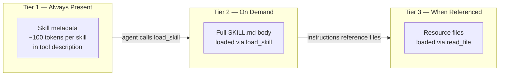
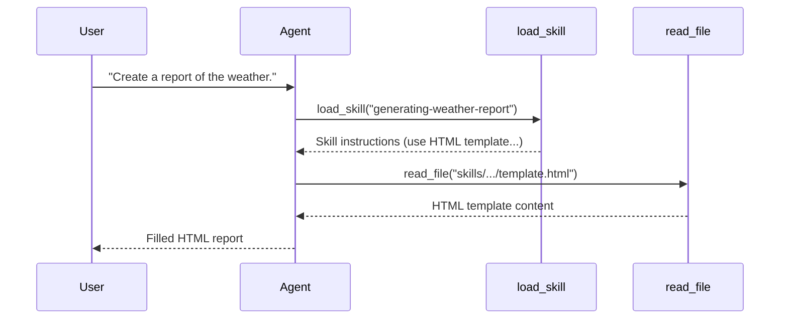

# Agent Skills

## What You'll Learn

- Why stuffing all domain knowledge into the system prompt doesn't scale
- How progressive disclosure solves this with three tiers of loading
- That a skill is just a tool that returns instructions — no new primitives needed
- How to build a SkillRegistry with directory scanning and YAML frontmatter parsing

## Prerequisites

- [Session Management](06-session-management.md) — the Agent and ToolRegistry we'll extend
- Python 3.10+
- OpenAI API key configured

## The Problem

Our agent from previous tutorials has one way to "know" things: the system prompt. Want it to generate HTML reports? Add report instructions to the system prompt. Want it to write emails in a specific format? Add email guidelines. Want it to follow a deployment checklist? More system prompt.

This doesn't scale:

- **15 domains × ~1,000 tokens = 15,000 tokens on every request**, even when irrelevant
- **More context = worse instruction following** — the model's attention gets diluted
- **Every user pays for every domain**, whether they need it or not

Three approaches exist:

| Approach | How it works | Problem |
|----------|-------------|---------|
| Always-loaded | Everything in system prompt | Wasteful, degrades quality |
| User-selected | User picks which domain to activate | Fragile, requires user knowledge |
| Agent-selected | Agent loads what it needs | Skills ✓ |

## The Insight

**A skill is a tool that returns instructions instead of data.**

No new primitives. No changes to the agent loop. No system prompt modifications. It's just another tool registered in the existing `ToolRegistry`.

Skills use **progressive disclosure** in three tiers:



- **Tier 1**: The LLM always sees skill names and descriptions (in the `load_skill` tool description)
- **Tier 2**: When the LLM decides a skill is relevant, it calls `load_skill` to get the full instructions
- **Tier 3**: The skill instructions may reference external files (templates, configs) that the agent fetches with existing tools like `read_file`

## Key Implementation

### Step 1 — Skill as Data

A skill is parsed from a `SKILL.md` file with YAML frontmatter:

```yaml
---
name: generating-weather-report
description: Generate a readable weather report based on the given weather data
---

# Weather Report Generation

Generate a weather report using the HTML template.

Template file: `skills/generating-weather-report/references/template.html`

Use the `read_file` tool to load the template, then fill in the placeholders.
```

The frontmatter (`name`, `description`) is tier 1 — always visible. The markdown body is tier 2 — loaded on demand. The referenced template file is tier 3 — loaded only when the agent follows the instructions.

We parse this into a simple dataclass:

```python
@dataclass
class Skill:
    name: str
    description: str
    content: str
```

### Step 2 — SkillRegistry

The `SkillRegistry` scans a directory for `SKILL.md` files and parses them:

```python
class SkillRegistry:
    def __init__(self, skill_dir: str | Path | None = None):
        self._skills: dict[str, Skill] = {}
        if skill_dir:
            self.register(skill_dir)

    def register(self, skill_dir: str | Path):
        skill_dir = Path(skill_dir)
        parser = re.compile(r"^---\s*(.*?)\s*---\s*(.*)$", re.DOTALL)

        for skill_file in skill_dir.glob("*/SKILL.md"):
            with open(skill_file) as f:
                skill_str = f.read()

            matched = parser.match(skill_str)
            if matched:
                skill_header_str, skill_content_str = matched.groups()
                try:
                    skill_header = yaml.safe_load(skill_header_str)
                    skill = Skill(
                        name=skill_header['name'],
                        description=skill_header['description'],
                        content=skill_content_str
                    )
                    self._skills[skill.name] = skill
                except Exception as e:
                    print(f"Warning: failed to parse {skill_file}: {e}")
```

The expected directory structure:

```
skills/
└── generating-weather-report/
    ├── SKILL.md                  # Skill definition (tier 1 + 2)
    └── references/
        └── template.html         # Resource file (tier 3)
```

Since skills are stored by name in a dict, calling `register()` multiple times gives you last-write-wins deduplication — project-local skills can override global ones.

### Step 3 — Skill as a Tool

This is the key mechanism. The `SkillRegistry` creates a single `load_skill` tool whose **description dynamically lists all available skills**:

```python
def create_load_skill_tool(self):
    def load_skill(skill_name):
        skill = self._skills.get(skill_name)
        if skill:
            return skill.content
        else:
            error_message = f"Skill {skill_name} not found. Available skills: {list(self._skills.keys())}"
            raise Exception(error_message)
    load_skill.__doc__ = self._get_load_skill_doc()

    class LoadSkillParameters(BaseModel):
        skill_name: str = Field(description="Skill name")

    return Tool.from_function(function=load_skill, parameters=LoadSkillParameters)

def _get_load_skill_doc(self):
    skill_doc = "Load a skill. A skill describes what to do when certain scenarios are met. The available skills are:\n"
    for _, skill in self._skills.items():
        skill_description = f"## Skill: {skill.name}\n{skill.description}"
        skill_doc += f"\n\n{skill_description}"
    return skill_doc
```

The trick: `load_skill.__doc__` is set **dynamically** to include all skill names and descriptions. When `Tool.from_function()` reads the docstring, these become part of the tool schema the LLM sees — this is how the LLM knows what skills exist without loading their full content.

### Step 4 — Integration with Agent

The Agent constructor accepts a `skill_dir` parameter and registers the `load_skill` tool alongside regular tools:

```python
class Agent:
    def __init__(self, tools=None, model="gpt-5.2", max_steps=10,
                 max_prompt_tokens=100_000, skill_dir=None):
        self._tool_registry = ToolRegistry()
        tools = tools or []
        for tool_dict in tools:
            tool_obj = Tool.from_function(**tool_dict)
            self._tool_registry.register(tool_obj)

        if skill_dir:
            skill_register = SkillRegistry(skill_dir)
            if skill_register.num_skills:
                self._tool_registry.register(skill_register.create_load_skill_tool())

        # ... rest unchanged
```

No changes to the agent loop. No changes to `_build_system_prompt()`. The skill system plugs in through the existing tool infrastructure.

## How It Works in Practice

Given tools `get_weather`, `read_file`, and the auto-registered `load_skill`:

```python
agent = Agent(tools, skill_dir="./skills/")
session = Session()

# Query 1: No skill needed — agent uses get_weather directly
response = agent.run("How is the weather in Beijing and LA?", session=session)

# Query 2: Agent recognizes it needs the report skill
response = agent.run("Create a report of the weather.", session=session)
```

For query 2, the agent's execution looks like:



The agent decided on its own to load the skill, read the instructions, fetch the template, and produce the report. All three tiers of progressive disclosure in action.

## What This Pattern Reveals

| Mechanism | Loads when | Good for | Bad for |
|-----------|-----------|----------|---------|
| System prompt | Every request | Core identity, universal rules | Domain-specific knowledge |
| Skill | Agent decides to load | Domain expertise, workflows | Anything needed every turn |
| Tool | Agent decides to call | Actions with side effects | Pure knowledge transfer |

Skills are the middle ground between "always present" system prompts and "action-oriented" tools. They're how you scale an agent to many domains without paying the token cost upfront.

## Full Implementation

See complete code: [`implementations/07_agent_skills/`](https://github.com/liaohaofu/agent-system-tutorials/tree/main/implementations/07_agent_skills)

- [`main.py`](https://github.com/liaohaofu/agent-system-tutorials/blob/main/implementations/07_agent_skills/main.py) — Skill, SkillRegistry, Agent integration, and example usage
- [`agent_utils.py`](https://github.com/liaohaofu/agent-system-tutorials/blob/main/implementations/07_agent_skills/agent_utils.py) — Shared utilities (Tool, ToolRegistry, Session, etc.)
- [`skills/generating-weather-report/SKILL.md`](https://github.com/liaohaofu/agent-system-tutorials/blob/main/implementations/07_agent_skills/skills/generating-weather-report/SKILL.md) — Example skill definition

## Try It Yourself

- [ ] Run `main.py` and observe the agent loading the skill only when needed
- [ ] Create a second skill (e.g., "email-summary") and verify the agent picks the right one based on user intent
- [ ] Add a second `register()` call with a different directory to test precedence (last-write-wins)
- [ ] Compare token usage: put the skill instructions directly in the system prompt vs. using `load_skill` — how much do you save on queries that don't need the skill?
- [ ] Write a skill that references multiple files in `references/` and watch the agent chain tool calls

## What's Next

In the next tutorial, [8. Session Persistence](08-session-persistence.md), we'll make sessions survive process restarts by persisting conversation history to disk — the first step toward agent memory.
