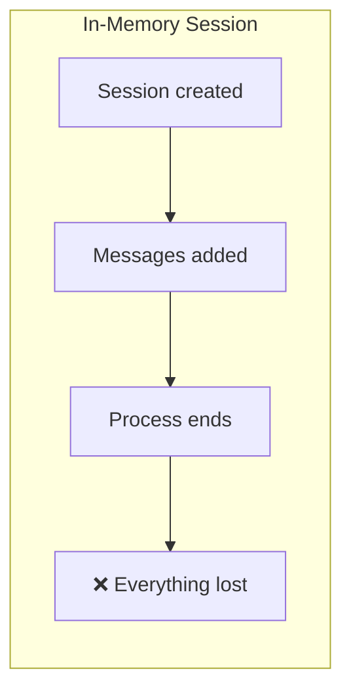
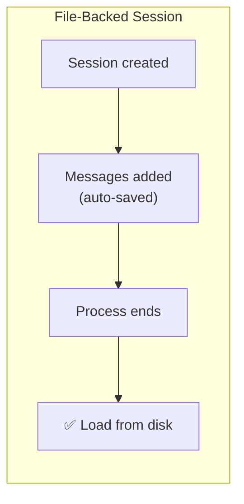

# Session Persistence

## What You'll Learn

- How to persist session history to disk as JSON files
- How to load and resume previous sessions across process restarts
- Why auto-save on mutation is simpler than explicit save
- How dataclass inheritance works for extending `Session`

## Prerequisites

- [Session Management](06-session-management.md) — the `Session` class we'll extend
- Python 3.10+
- OpenAI API key configured

## The Problem

Our `Session` class from the previous tutorial stores messages in memory. When the process ends, everything is lost. A user asks the agent about the weather, closes the terminal, comes back later, and has to start from scratch.

This is the first step toward memory: **short-term memory that outlives the process**.





## The Design

The key decision: **extend `Session`, don't replace it**. The `Agent` class accepts any `Session` — it doesn't know or care whether messages are persisted. This keeps the persistence concern out of the agent loop entirely.

| Decision | Choice | Why |
|----------|--------|-----|
| Storage format | JSON file per session | Human-readable, easy to debug |
| When to save | Auto-save on every mutation | Never lose messages, simple contract |
| What to store | ID, timestamp, messages | Minimum metadata needed for resumption |
| How to extend | Dataclass inheritance | Reuse base `Session` interface |

## Key Implementation

### FileSession — Extending Session

`FileSession` inherits from `Session` and adds persistence. The `kw_only=True` decorator solves a Python dataclass limitation where child fields without defaults can't follow parent fields with defaults:

```python
@dataclass(kw_only=True)
class FileSession(Session):
    session_dir: str
    id: str = field(default_factory=lambda: str(uuid.uuid4()))
    created_at: datetime = field(default_factory=lambda: datetime.now())
    _messages: list[dict] = field(default_factory=list)

    def __post_init__(self):
        self.save()
```

On creation, the session immediately saves itself to disk — even an empty session gets a file. This ensures a session ID always maps to a file.

### Auto-Save on Mutation

Every method that changes messages triggers a save. The `Agent` class calls `add_message` and `set_messages` — both now persist automatically:

```python
def add_message(self, role, content):
    super().add_message(role, content)
    self.save()

def set_messages(self, messages: list[dict]):
    super().set_messages(messages)
    self.save()
```

This means if the process crashes mid-conversation, you only lose the current LLM call — all previous messages are already on disk.

### Save and Load

The session serializes to a simple JSON structure:

```python
def save(self):
    session_json = self.asjson()
    session_file = Path(self.session_dir, f"{self.id}.json")
    session_file.parent.mkdir(parents=True, exist_ok=True)
    with open(session_file, 'w') as f:
        f.write(session_json)

def asjson(self):
    session = {
        'id': self.id,
        'created_at': self.created_at.isoformat(),
        'messages': self._messages
    }
    return json.dumps(session)
```

Loading reconstructs the session from the JSON file:

```python
@classmethod
def load(cls, session_id: str, session_dir: str) -> "FileSession":
    session_file = Path(session_dir, f"{session_id}.json")

    if not session_file.exists():
        raise FileNotFoundError(f"Session file {session_file} does not exist.")

    with open(session_file) as f:
        session = json.load(f)
    created_at = datetime.fromisoformat(session["created_at"])
    messages = session["messages"]

    return cls(session_dir=session_dir, id=session_id,
               created_at=created_at, _messages=messages)
```

### Session Discovery

A simple class method to list available sessions:

```python
@classmethod
def list_sessions(cls, session_dir: str) -> list:
    session_ids = []
    for session_file in Path(session_dir).glob("*.json"):
        session_ids.append(session_file.name)
    return session_ids
```

## How Resumption Works

The demo shows a two-phase conversation. Phase 1 asks about weather and saves the session. Phase 2 loads the same session and continues — the agent remembers the weather data from the first conversation:

```python
# Phase 1: Ask about weather
session = FileSession(session_dir="./sessions")
response = agent.run("How is the weather in Beijing and LA?", session=session)

# Phase 2: Resume and continue
session = FileSession.load(session_id=session.id, session_dir="./sessions")
response = agent.run("Send a summary of the weather to me via email", session=session)
# Agent remembers the weather data from phase 1!
```

The agent doesn't need any special logic — it sees the full message history as if the conversation never stopped.

### What About Compaction?

If the session was compacted (summarized to save tokens) before saving, the file stores the compacted state. When you load it, you get the summary — not the original messages. This is correct: the compacted version is what the agent was working with, and it's what should persist.

## Full Implementation

See complete code: [`implementations/08_session_persistence/`](https://github.com/liaohaofu/agent-system-tutorials/tree/main/implementations/08_session_persistence)

- [`main.py`](https://github.com/liaohaofu/agent-system-tutorials/blob/main/implementations/08_session_persistence/main.py) — Agent with FileSession demo showing cross-process resumption
- [`agent_utils.py`](https://github.com/liaohaofu/agent-system-tutorials/blob/main/implementations/08_session_persistence/agent_utils.py) — Session, FileSession, and shared utilities

## Try It Yourself

- [ ] Run `main.py` and inspect the JSON file created in `sessions/` — what does the session look like on disk?
- [ ] Modify the demo to use two separate Python invocations (run phase 1, then manually run phase 2 with the session ID) to verify true cross-process resumption
- [ ] Add an `updated_at` field that tracks when the session was last modified
- [ ] Implement a `delete()` method that removes the session file
- [ ] Try a `SQLiteSession` that stores messages in a SQLite database instead of JSON files — same interface, different backend
